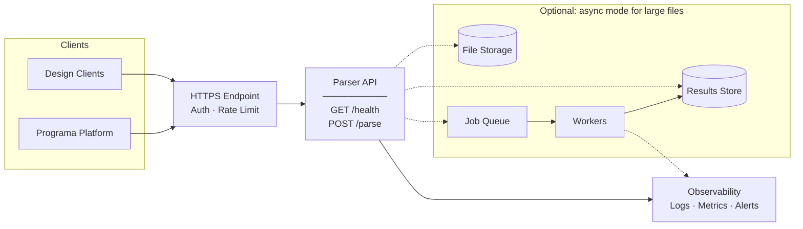

# Interior Schedule Parser API

A Python REST API that parses interior designer Excel schedules (.xlsx) into structured JSON. Built with FastAPI, this service handles the variability of real-world schedule formats including inconsistent column names, merged cells, multiple sheets, and diverse layouts, accurately extracting and standardizing product data for seamless import into product management platforms.

## Table of Contents

- [Quick Start](#quick-start)
- [API Documentation](#api-documentation)
- [Architecture](#architecture)
- [Design Decisions](#design-decisions)
- [Known Limitations](#known-limitations)
- [Testing](#testing)
- [Project Structure](#project-structure)
- [Development Process](#development-process)

## Quick Start

### Prerequisites

- Python 3.11+
- pip

### Local Setup

```bash
# Clone and navigate to project
git clone https://github.com/nikjohn7/design-specs-parser.git
cd design-specs-parser

# Create virtual environment and install dependencies
python -m venv .venv
source .venv/bin/activate  # On Windows: .venv\Scripts\activate
pip install -r requirements.txt

# Run the server
uvicorn app.main:app --reload
```

The API will be available at `http://localhost:8000`.

### Docker

```bash
# Build the image
docker build -t programa-parser .

# Run the container
docker run -p 8000:8000 programa-parser
```

## API Documentation

Interactive API documentation is available at:

- **Swagger UI**: http://localhost:8000/docs
- **ReDoc**: http://localhost:8000/redoc

### Endpoints

| Method | Endpoint | Description |
|--------|----------|-------------|
| POST | `/parse` | Parse an Excel schedule into JSON |
| GET | `/health` | Health check |

### Status Codes & Errors

| Status | Meaning | Response body |
|--------|---------|---------------|
| 200 | Successfully parsed schedule | `ParseResponse` |
| 400 | Invalid upload or workbook could not be parsed | `ErrorResponse` |
| 422 | Request validation error (e.g., missing `file` form field) | `ErrorResponse` |

**Example error response (422):**

```json
{
  "error": "Validation error",
  "detail": "Missing required form field: file"
}
```

### Example Request/Response

**Request:**

```bash
curl -X POST -F "file=@data/schedule_sample1.xlsx" http://localhost:8000/parse
```

**Response:**

```json
{
  "schedule_name": "12006: GEM, WATERLINE PLACE, WILLIAMSTOWN",
  "products": [
    {
      "doc_code": "FCA-01 A",
      "product_name": "ICONIC",
      "brand": "VICTORIA CARPETS",
      "colour": "SILVER SHADOW",
      "finish": null,
      "material": "80% WOOL 20% SYNTHETIC",
      "width": 3660,
      "length": null,
      "height": null,
      "qty": null,
      "rrp": 45.5,
      "feature_image": null,
      "product_description": "FLOORING | CARPET\n\nAPARTMENTS\nGOLD SCHEME",
      "product_details": "CODE: 50/2833 | STYLE: TWIST | CARPET_THICKNESS: 11 MM | ..."
    }
  ]
}
```

### Output Fields

| Field | Type | Description |
|-------|------|-------------|
| `doc_code` | string | Drawing or reference code |
| `product_name` | string | Product display name |
| `brand` | string | Manufacturer/brand name |
| `colour` | string | Colour name |
| `finish` | string | Surface finish |
| `material` | string | Main material |
| `width` | integer | Width in mm |
| `length` | integer | Length in mm |
| `height` | integer | Height/depth in mm |
| `qty` | integer | Quantity |
| `rrp` | decimal | Recommended retail price |
| `feature_image` | string | Image filename (optional) |
| `product_description` | string | Short description |
| `product_details` | string | Additional specifications |

## Operational Notes

- Parsing is synchronous: the request returns only after the workbook is fully parsed.
- Uploads are read into memory (`UploadFile.read()`), and workbooks are loaded in-memory via `openpyxl`.
- No explicit max upload size is configured in the app; practical limits depend on the server/proxy and available memory/CPU.
- Included sample files range from ~1.4MB to ~47MB (`data/`).

## Architecture

### Parsing Pipeline


### Component Responsibilities

| Component | Purpose |
|-----------|---------|
| **Workbook Loader** | Load .xlsx files safely, extract schedule name |
| **Sheet Detector** | Identify schedule sheets by scoring header rows |
| **Merged Cell Handler** | Fill merged cell regions for consistent reading |
| **Column Mapper** | Map varied header names to canonical columns |
| **Row Extractor** | Iterate product rows, handle grouped layouts |
| **Field Parser** | Extract key-value pairs from specification text |
| **Normalizers** | Convert dimensions to mm, parse prices |

### Proposed Production Deployment



**Key production considerations:**

- **Stateless API**: Horizontally scalable behind HTTPS endpoint with auth and rate limiting
- **Sync-first design**: `POST /parse` returns results directly; suitable for most file sizes
- **Optional async mode**: Large files can be queued for background processing (dashed paths)
- **Observability**: Centralized logs, metrics, and alerts for API and workers
- **Container-ready**: Docker HEALTHCHECK + non-root user for orchestrator compatibility

## Design Decisions

### 1. openpyxl over pandas

Chosen for fine-grained control over merged cells, formula handling, and cell-level operations. Pandas abstracts away details needed to handle real-world schedule complexity.

### 2. Rules + Heuristics Parsing (No ML/LLM)

The parser uses deterministic rules and pattern matching rather than ML models:
- Explainable and debuggable behavior
- No external API dependencies
- Consistent, reproducible results
- Lower operational complexity

### 3. All Fields Optional

Every output field defaults to `null`. When data is missing from the input, the parser returns partial output rather than failing with validation errors.

### 4. Fuzzy Header Matching

Headers are matched against synonym lists using case-insensitive comparison and fuzzy matching. This handles variations like `QTY`, `Quantity`, `QUANTITY`, `Qty.` mapping to the same canonical column.

### 5. De-duplication by doc_code

When the same `doc_code` appears across multiple sheets (common in schedules with both "Schedule" and "Sales Schedule" sheets), the first occurrence is kept. Products with no `doc_code` are all retained.

### 6. Dimension Normalization to mm

All dimensions are converted to millimeters:
- `3.66 METRES` → `3660`
- `60 CM` → `600`
- `600 W X 600 H MM` → `width: 600, height: 600`

### 7. Multi-Layout Support

The parser handles three layout patterns:
- **Single-row-per-product**: Each row is a complete product (samples 1, 2)
- **Grouped rows**: Product header followed by detail rows with `Key: Value` format (sample 3)
- **Section headers**: Merged cells indicating category context (sample 1)

## Known Limitations

1. **No image extraction**: Embedded images are not currently extracted. The `feature_image` field is reserved for future implementation.

2. **External workbook references**: Formulas referencing other workbook files (e.g., `='[1]Cover Sheet'!A6`) cannot be resolved by openpyxl. The parser falls back to reading the target cell directly or using the filename. Formulas within the same workbook are resolved correctly.

3. **Ambiguous dimensions**: When a specification contains only `SIZE: 5500 X 2800 MM` without W/L/H indicators, the parser assigns width and length but cannot determine orientation.

4. **Price context ignored**: Prices extracted as numeric values only. Context like "PER SQM" or "PER LINEAR METRE" is not preserved.

5. **No password-protected files**: Encrypted or password-protected workbooks will fail to parse.

6. **Sheet name matching**: Sheets are detected by header content, not name. A sheet named "Notes" with a valid product table header will be parsed.

## Testing

```bash
# Activate virtual environment
source .venv/bin/activate

# Run fast tests (excludes synthetic data tests)
pytest -v -m "not synthetic"

# Run synthetic robustness tests
pytest -v -m synthetic

# Run all tests
pytest -v

# Run with coverage
pytest --cov=app --cov-report=term-missing
```

### Test Categories

- **Unit tests**: Field parsing, dimension normalization, price extraction
- **Integration tests**: Full API endpoint testing with sample files
- **Synthetic tests**: Robustness testing with generated and mutated schedules

### Synthetic Test Generator

```bash
python tools/generate_programa_test_schedules.py \
  --mode both \
  --samples_dir ./data \
  --output_dir ./synthetic_out \
  --num_generated 20 \
  --seed 12345
```

The provided sample files served as baselines for understanding real-world schedule formats. To ensure the parser handles edge cases robustly, I built a generator that creates varied workbooks with challenges like header row shifts, merged cells, hidden columns, formula references, and diverse delimiter styles.

**Modes:**
- `generate` — Create new synthetic schedules with ground truth JSON
- `mutate` — Apply mutations to existing samples (no ground truth, metadata only)
- `both` — Run both generation and mutation

## Project Structure

```
.
├── app/
│   ├── main.py              # FastAPI application entry point
│   ├── api/
│   │   └── routes.py        # API endpoint definitions
│   ├── core/
│   │   └── models.py        # Pydantic models (Product, ParseResponse)
│   └── parser/
│       ├── workbook.py      # Workbook loading, schedule name extraction
│       ├── sheet_detector.py # Header detection, schedule sheet identification
│       ├── merged_cells.py  # Merged cell region handling
│       ├── column_mapper.py # Header-to-column mapping
│       ├── row_extractor.py # Product row iteration
│       ├── field_parser.py  # Key-value text parsing
│       └── normalizers.py   # Dimension and price normalization
├── data/                    # Sample schedule files
├── tests/                   # Test suite
├── tools/                   # Synthetic data generator
├── Dockerfile
├── requirements.txt
└── README.md
```

## Development Process

### Time Investment

Total time: approximately **10.5–11 hours** over several days.

| Phase | Time | Activities |
|-------|------|------------|
| Planning | ~1.5 hours | Requirements analysis, architecture planning, writing CLAUDE.md, structuring tasks |
| Implementation | ~7 hours | Core parsing pipeline, API endpoints, handling edge cases |
| Testing & Polish | ~2 hours | Unit/integration tests, synthetic test generator, documentation |

### AI Assistance

AI tools were used to augment (not replace) development in the following areas:

- **Planning documentation**: After manual planning, AI helped structure notes into CLAUDE.md and task breakdowns
- **Code development**: AI acted as a pair programmer, augmenting implementation and debugging based on my documented task instructions and planning
- **Commit messages & PRs**: AI assisted with writing clear, conventional commit messages and PR descriptions based on provided context
- **Code review**: [Cubic](https://cubic.dev) AI code reviewer scanned all PRs, supplementing manual review
- **Documentation polish**: AI helped refine README sections and ensure consistency

All architectural decisions were made manually.

## License

This project was created as part of a technical assessment.
